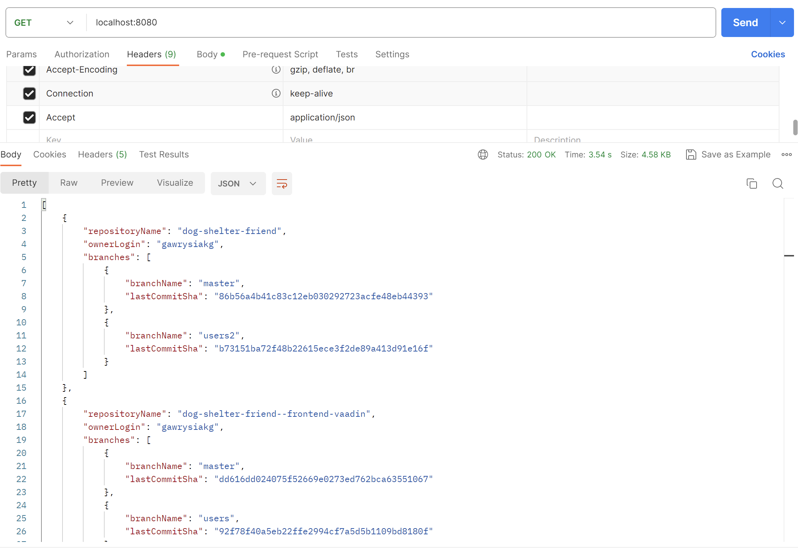
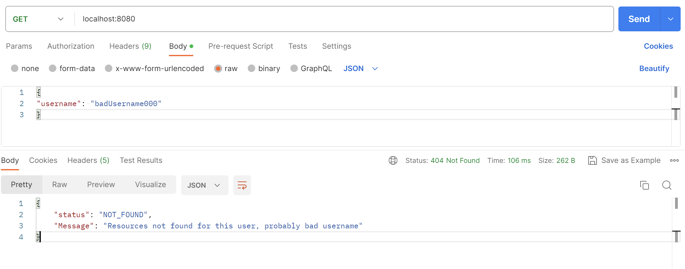
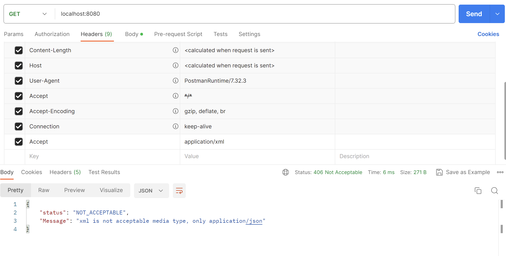
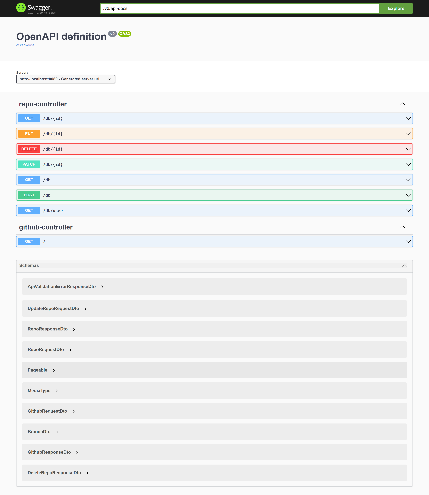

## Repository Finder App

### An application that retrieves all user repositories (that are not forks), all branch names,and the sha of the last commit for each branch. Another feature of the application is the ability to manually add, remove, update individual repositories in the database. When we use GetMapping with GithubController, we will get a list of all repositories of a given user, additionally, the application will update its database with repositories that it did not have before.

### Used Technologies:
- SpringBoot (with Error Handling, Validation, Pageable)
- Docker compose
- PostgreSQL
- Swagger
- Github API

As an api consumer, give json:
```
{
"username": "your_username"
}
```
and header: “Accept: application/json”
This app will list all Github repositories, which are not forks, for example Repository Name, Owner Login, For each branch it’s name and last commit sha.
#
This is a result:
```
[
    {
        "repositoryName": "dog-shelter-friend",
        "ownerLogin": "gawrysiakg",
        "branches": [
            {
                "branchName": "master",
                "lastCommitSha": "86b56a4b41c83c12eb030292723acfe48eb44393"
            },
            {
                "branchName": "users2",
                "lastCommitSha": "b73151ba72f48b22615ece3f2de89a413d91e16f"
            }
        ]
    },
    {
        "repositoryName": "dog-shelter-friend--frontend-vaadin",
        "ownerLogin": "gawrysiakg",
        "branches": [
            {
                "branchName": "master",
                "lastCommitSha": "dd616dd024075f52669e0273ed762bca63551067"
            },
            {
                "branchName": "users",
                "lastCommitSha": "92f78f40a5eb22ffe2994cf7a5d5b1109bd8180f"
            }
        ]
    }
]
```
#
As an api consumer, if you give not existing Github user, You will receive 404 response in such a format:
```
{
    "status": "NOT_FOUND",
    "Message": "Resources not found for this user, probably bad username"
}
```
#
As an api consumer, if You give header “Accept: application/xml”, You will receive 406 response in such a format:
```
{
    "status": "NOT_ACCEPTABLE",
    "Message": "xml is not acceptable media type, only application/json"
}
```
#
### Postman screens:







#
### Swagger


#
### Author: GG


 